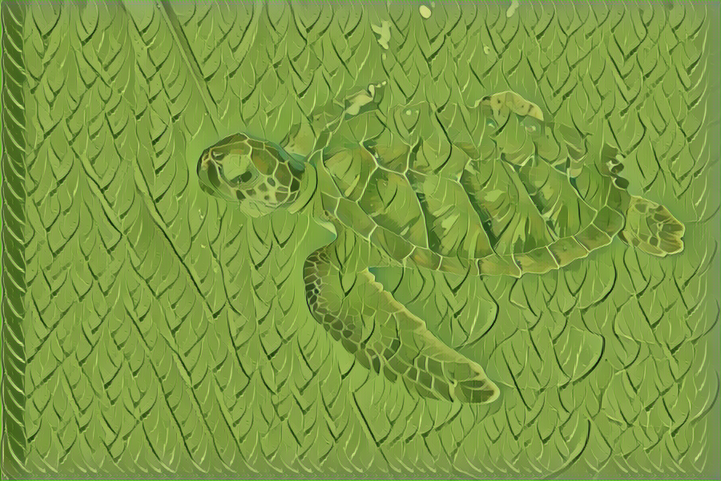

# fastNeuralStyle

<u>**Please note that this project is not based on standard python scripts (.py) so that it only works in Jupiter Notebook and Visdom. There for you need to installed them before running this project. An alternative is to change the whole project to standard python scripts (.py) which won't take much time.</u>**

This is the pyTorch implementation of Fast Neural Style, for more details of this network, please refer to the original paper:

> Johnson, Justin, Alexandre Alahi, and Li Fei-Fei. "Perceptual losses for real-time style transfer and super-resolution." *European Conference on Computer Vision*. Springer, Cham, 2016.

### Requirement (tested on Ubuntu 18.04)

- pyTorch 0.4.0+
- Jupyter Notebook
- Visdom
- ipdb, tqdm

### How to use

1. Download MS COCO dataset from [here](http://images.cocodataset.org/zips/train2014.zip), and unzip the folder to "datasets".
2. Open "config.ipynb" in Jupyter Notebook and change the settings according to your hardware configuration, note that the ratio of w_content and w_style should be chosen carefully.
3. Open "train.ipynb" in Jupyter Notebook and click "Cell - Run all" to start training.
4. During training you can view the output from Visdom, the traning results (.pth) will be saved in "saves".
5. After training, use "test.ipynb" to run the trained network.

|  |  |  |
| ------------------------------------------------------------ | ------------------------------------------------------------ | ------------------------------------------------------------ |
|  |  |  |

### Improvement

This project uses the original network structure proposed without further modification and thus the output may not be very good sometimes. However, there are some other improved versions available such as adding reflection padding or replacing transposed convolution with upsampling followed by convolution.